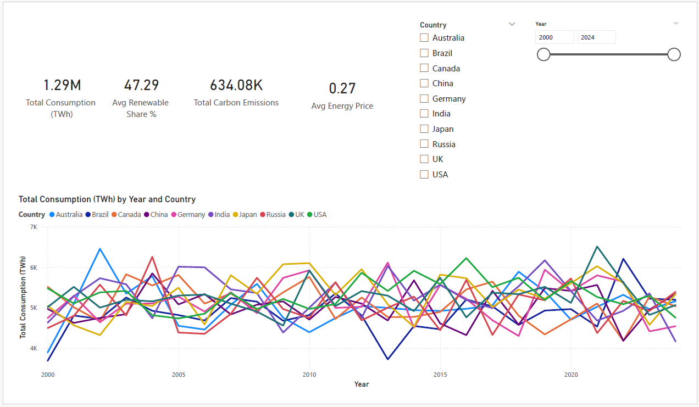
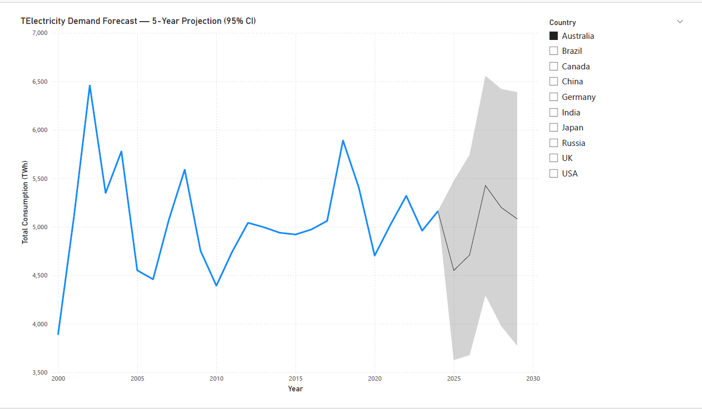
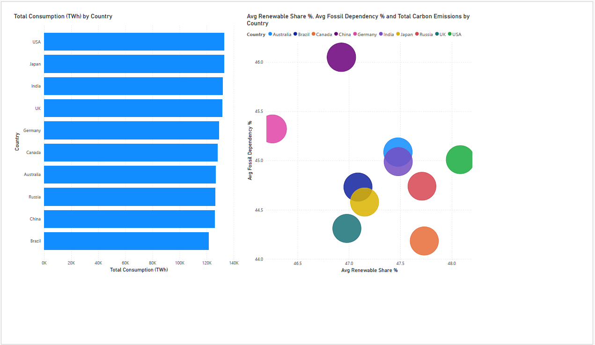

# Electricity Demand Forecast Dashboard

Power BI dashboard analysing global electricity consumption trends (2000–2024) across 10 major economies, with statistical demand forecasting for energy planning.

## Project Overview

This project analyses historical electricity consumption data for 10 countries (Australia, Brazil, Canada, China, Germany, India, Japan, Russia, UK, USA) over a 25-year period, and forecasts future demand using Power BI's built-in exponential smoothing forecast model. The goal is to turn raw yearly consumption data into insights that support energy planning and cross-country comparison.

## Objectives

- Analyse electricity consumption trends across countries, 2000–2024
- Identify the highest and lowest consuming countries year over year
- Forecast electricity demand 5 years ahead using statistical forecasting
- Compare renewable energy adoption against fossil fuel dependency and carbon emissions

## System Architecture

- **Data Collection Layer** — global energy consumption dataset (country-year level)
- **Data Processing Layer** — Power Query cleaning, deduplication, and aggregation to a consistent yearly time series
- **Analysis Layer** — DAX measures for YoY growth, averages, and totals
- **Visualisation Layer** — Power BI dashboard (3 pages)

## Key Features

- Multi-country yearly consumption trend line chart
- Statistical demand forecast (5-year projection, 95% confidence interval) using Power BI's Analytics forecasting engine
- Country comparison: consumption ranking, renewable share vs fossil dependency scatter plot
- Interactive slicers for Country and Year
- KPI cards for total consumption, renewable share, carbon emissions, and energy price

## Technologies Used

- Microsoft Power BI (Power Query, DAX, forecasting analytics)
- Microsoft Excel / CSV data preparation
- Python (pandas) for initial data cleaning and aggregation

## Data Pipeline Workflow

1. Data collection (public global energy consumption dataset)
2. Data cleaning and deduplication (Power Query)
3. Aggregation to one row per country per year
4. DAX measure creation for trend and comparison metrics
5. Forecast modelling (Power BI Analytics pane, exponential smoothing)
6. Dashboard visualisation and formatting

## Use Cases

- Electricity demand forecasting for planning purposes
- Cross-country energy consumption benchmarking
- Renewable energy adoption tracking
- Utility and policy reporting

## Data Limitations

This dataset is yearly and country-level, not monthly or region-level. It does not include smart grid or sensor-level data. The forecast is a statistical projection based on historical trend patterns available in the data — it is a demonstration of forecasting methodology, not an official energy planning forecast.

## Screenshots

## Key Learnings

- Time-series data cleaning and deduplication
- Power BI statistical forecasting (exponential smoothing, confidence intervals)
- DAX measure design (YoY growth, aggregations)
- Dashboard storytelling across multiple pages

## Future Improvements

- Rebuild with monthly/hourly grid-level data (e.g. EIA or ENTSO-E) for finer-grained forecasting
- Add regional (state/province) breakdowns
- Incorporate weather data as a demand driver

## Author

Anne Subashini Sritharan

## Project Note

This project demonstrates how Power BI can be used to turn multi-year global energy data into forecasting and comparison insights that support energy planning decisions.
